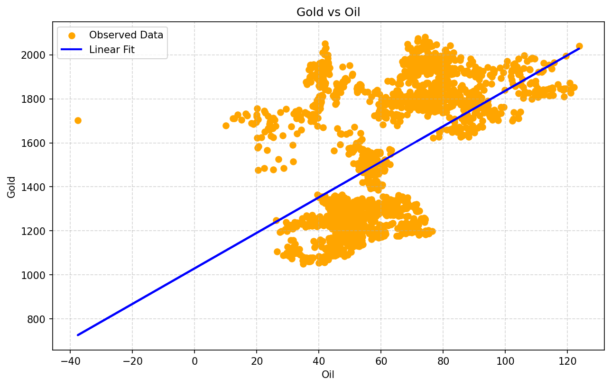

# Gold vs Oil Price Prediction

A machine learning project that uses **Simple Linear Regression** to investigate the relationship between oil prices and gold prices using live historical market data. Built as part of an ongoing journey learning supervised machine learning, applying it across astronomy and finance domains.

---

## Project Overview

This project explores whether oil price can be used to predict gold price. The gold-oil relationship is a well-known concept in finance — rising oil prices drive inflation, which historically pushes investors toward gold as a safe haven asset. By fitting a linear regression model on 9 years of daily market data (2015–2024), we quantify the strength and limitations of this relationship.

---

## Dataset

- **Source:** Yahoo Finance via the `yfinance` Python library
- **Tickers:**
  - `GC=F` — Gold Futures (price per troy ounce in USD)
  - `CL=F` — WTI Crude Oil Futures (price per barrel in USD)
- **Period:** January 2015 — January 2024
- **Observations:** 2,261 trading days
- **Feature Used:** Daily closing prices for both assets

No CSV download required — data is pulled directly via API.

---

## Method

- **Algorithm:** Simple Linear Regression (single input feature)
- **Library:** scikit-learn
- **Split:** 80% training / 20% testing (random_state=42)
- **Input (x):** Oil closing price
- **Target (y):** Gold closing price

---

## Results

| Metric | Value |
|--------|-------|
| R² Score | 0.281 |
| MAE | $217.39 per ounce |
| RMSE | $253.19 per ounce |
| MSE | 64,106.16 |

**Interpretation:**
- Oil price explains only **28.1%** of gold price variation over this period
- On average predictions are off by **$217 per ounce**
- RMSE noticeably higher than MAE — indicating periods where the model predictions were severely wrong

---

## Key Finding

The scatter plot reveals the core problem — the data forms **three distinct market regime clusters** rather than a single continuous linear relationship:

- **2015–2016:** Oil crash period — low oil, moderate gold
- **2017–2019:** Recovery period — rising oil, stable gold
- **2020–2024:** Post-COVID period — volatile oil, surging gold

A single linear model cannot capture regime-dependent behaviour. The April 2020 event — when oil futures briefly turned **negative** for the first time in history — appears as an extreme outlier on the x-axis, further destabilising the model.

This result demonstrates a fundamental principle of financial ML:

> *Asset correlations are not stable over time. They shift with market conditions, making simple linear models insufficient for financial price prediction.*

---

## Visualisation



The scatter plot clearly shows clustered market regimes and the linear fit struggling to represent all three simultaneously.

---

## Project Structure

```
gold-oil-price-regression/
│
├── gold_oil_regression.ipynb    # Jupyter notebook with full analysis
├── plot.png                     # Scatter plot with regression line
└── README.md                    # This file
```

---

## How to Run

```bash
# Clone the repository
git clone https://github.com/Joey756/gold-oil-price-regression.git
cd gold-oil-price-regression

# Install dependencies
pip install numpy pandas matplotlib scikit-learn yfinance

# Open the notebook
jupyter notebook gold_oil_regression.ipynb
```

---

## Dependencies

- Python 3.x
- numpy
- pandas
- matplotlib
- scikit-learn
- yfinance

---


## Author


- GitHub: [Joey756](https://github.com/Joey756)

